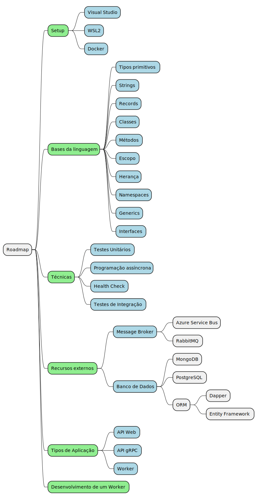

# Objetivo

Desenvolver uma nova linguagem de programação (c#) para as pessoas de nossa torre, que conhecem apenas Cobol, e precisam desenvolver uma nova linguagem de programação.

# Como faremos

1. Começaremos com um piloto​
2. Média de 5 pessoas por turma​
3. Linguagem a ser ensinada: c#​
4. Pre Requisito: conhecer apenas Cobol​
5. Quando: toda sexta feira das 13:30 as 16:30​
6. Treinamento será gravado​
7. Duração Média: 3 meses​
8. Instrutor: Furlan

# Nosso compromisso

Direcionar essas pessoas para equipes que desenvolvam em c#, para que possam dar continuidade ao aprendizado.​

# Pauta

1. Falar sobre a estrutura básica:​
   - Tipos primitivos, acessibilidade, funções, classes, records, herança, genéricos, strings​
​2. Construir um Worker na pratica com toda a galera​
3. Dúvidas poderão ser tiradas via chat

## Roadmap

