# Solutions

As aplicações dotnet são organizadas de forma componentizada.

Uma *solution* contém uma coleção de projetos, junto com as informações de dependência entre estes. 

Os projetos, por sua vez, estão em subpastas com seus arquivos-fonte. Uma solution pode ter um ou mais projetos, e inclusive um projeto pode ser compartilhado por mais de uma solution, mas isso não é comum no nosso contexto.

```mermaid
classDiagram
    Solution <|-- ClassLib
    Solution <|-- AspNet API
    Solution <|-- Worker
    Solution : NossaAplicação.sln    
    class ClassLib {
        Biblioteca.csproj
    }
    class AspNet API {
        API.csproj
    }
    class Worker{
        Worker.csproj
    }
```



# Projects

Os projetos tem duas funções principais: ser um contêiner para os arquivos-fontes e compilar estes arquivos em algum tipo de componente, definido pelo tipo do projeto. Os tipos de projeto disponíveis no nosso SDK podem ser verificados com o comando abaixo:

``` text
❯ dotnet new --list
These templates matched your input:

Template Name                                 Short Name      Language    Tags
--------------------------------------------  --------------  ----------  --------------------------
ASP.NET Core Empty                            web             [C#],F#     Web/Empty
ASP.NET Core gRPC Service                     grpc            [C#]        Web/gRPC
ASP.NET Core Web API                          webapi          [C#],F#     Web/WebAPI
ASP.NET Core Web App                          webapp,razor    [C#]        Web/MVC/Razor Pages
ASP.NET Core Web App (Model-View-Controller)  mvc             [C#],F#     Web/MVC
ASP.NET Core with Angular                     angular         [C#]        Web/MVC/SPA
ASP.NET Core with React.js                    react           [C#]        Web/MVC/SPA
Blazor Server App                             blazorserver    [C#]        Web/Blazor
Blazor WebAssembly App                        blazorwasm      [C#]        Web/Blazor/WebAssembly/PWA
Class Library                                 classlib        [C#],F#,VB  Common/Library
Console App                                   console         [C#],F#,VB  Common/Console
dotnet gitignore file                         gitignore                   Config
Dotnet local tool manifest file               tool-manifest               Config
EditorConfig file                             editorconfig                Config
global.json file                              globaljson                  Config
MSTest Test Project                           mstest          [C#],F#,VB  Test/MSTest
MVC ViewImports                               viewimports     [C#]        Web/ASP.NET
MVC ViewStart                                 viewstart       [C#]        Web/ASP.NET
NuGet Config                                  nugetconfig                 Config
NUnit 3 Test Item                             nunit-test      [C#],F#,VB  Test/NUnit
NUnit 3 Test Project                          nunit           [C#],F#,VB  Test/NUnit
Protocol Buffer File                          proto                       Web/gRPC
Razor Class Library                           razorclasslib   [C#]        Web/Razor/Library
Razor Component                               razorcomponent  [C#]        Web/ASP.NET
Razor Page                                    page            [C#]        Web/ASP.NET
Solution File                                 sln,solution                Solution
Web Config                                    webconfig                   Config
Worker Service                                worker          [C#],F#     Common/Worker/Web
xUnit Test Project                            xunit           [C#],F#,VB  Test/xUnit
```

# Criando nossa primeira solution

Observando os templates disponíveis na lista anterior, *Solution File* usa as chaves _sln_ e _solution_. Dessa maneira, vamos usar o terminal para criar nossa solution.

```bash
❯ dotnet new sln -n NossaPrimeiraSolution
The template "Solution File" was created successfully.

❯ dotnet new console --name "ConsoleApp"
The template "Console App" was created successfully.

Processing post-creation actions...
Running 'dotnet restore' on /mnt/c/dev/tmp/dotnet/ConsoleApp/ConsoleApp.csproj...
  Determining projects to restore...
  Restored /mnt/c/dev/tmp/dotnet/ConsoleApp/ConsoleApp.csproj (in 119 ms).
Restore succeeded.

❯ tree
.
├── ConsoleApp
│   ├── ConsoleApp.csproj
│   └── Program.cs
└── NossaPrimeiraSolution.sln

1 directory, 3 files
```

Utilizando o Visual Studio, basta criar um projeto que a solution vai ser criada ao mesmo tempo.


Testando o nosso primeiro app de console:

```bash
console/NossaAplicacaoConsole/NossaAplicacaoConsole via .NET v6.0.403 🎯 net6.0
❯ dotnet run .
Olá, mundo AmbevTech!
```