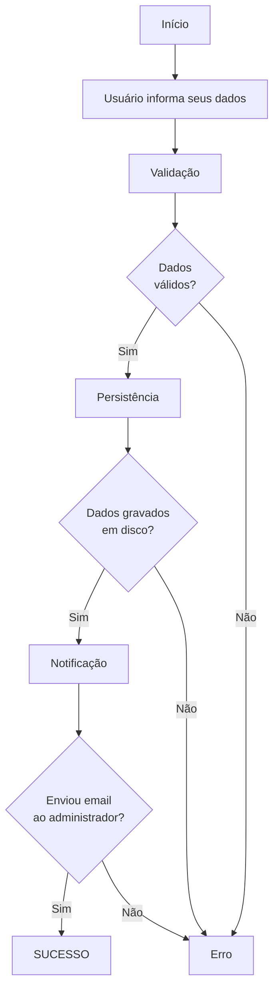

# Bases da linguagem

## Herança

Herança é um dos pilares da POO (Programação Orientada a Objeto). Na definição de classes, podemos reutilizar propriedades e métodos genéricos e especializar comportamentos de acordo com as necessidades.

Ainda com relação à orientação a objeto, é sempre importante lembrar do acrônimo SOLID, nesse caso o S que significa Single Responsability Principle.

Este princípio diz que uma classe deve fazer uma coisa só, e fazer bem. Em outras palavras, uma classe deve ter apenas uma razão para mudar. Classes genéricas que fazem de tudo, estão violando este princípio e produzindo código grande, mais difícil de manter e de testar.

Um exemplo prático é uma operação de cadastro de usuário, onde teríamos o seguinte fluxo:



Uma classe genérica poderia ser assim

```csharp
  public class UserAccounterBadApproach
    {
        private string _name;
        private string _email;

        public UserAccounterBadApproach(string name, string email)
        {
            _name = name;
            _email = email;
        }

        public void Validate()
        {
            if (string.IsNullOrEmpty(_name))
                throw new ArgumentNullException("name");
            if (string.IsNullOrEmpty(_email))
                throw new ArgumentNullException("email");
        }

        public void Persist()
        {
            // CODE FOR SAVING THE USER DATA INTO FILE
            File.WriteAllText("user.txt", $"{_name}_{_email}");
            // Will throw exception if cannot write
        }

        public void NotifyAdmin()
        {
            // CODE FOR SENDING EMAIL TO ADMIN
            Console.WriteLine($"Hey, admin. New user is comming {_name}");
        }


        public void ReceiveUser()
        {
            Validate();
            Persist();
            NotifyAdmin();
        }
    }
```

Uma classe melhor definida teria suas funções segregadas em classes especialistas, com o uso de interfaces evitando o acoplamento direto:

```csharp
    public class UsserAccounterBestApproach
    {
        private User _user;
        private IUserValidator _validator;
        private IUserRepository _repository;
        private INotifier _notifier;

        public UsserAccounterBestApproach(User user, IUserValidator userValidator, IUserRepository userRepository, INotifier notifier)
        {
            _user = user;
            _validator = userValidator;
            _repository = userRepository;
            _notifier = notifier;

        }

        public void ReceiveUser()
        {
            _validator.Validate(_user);
            _repository.Save(_user);
            _notifier.Notify($"Hey, admin. New user is comming {_user}");
        }
    }
```
