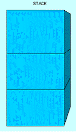
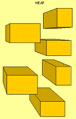
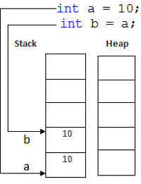
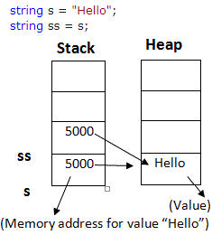
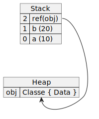

# Porque a *stack* é mais rápida que o *heap*?

## Fato: Ambos, stack e heap, estão na RAM. Então, porque a stack é mais rápida do que o heap?

Resposta abstrata: Está relacionado a *COMO* elas são alocadas na memória.

## Stack

Stack é um espaço contíguo na memória, uma área sequencial de 1MB (em sistemas de 32 bits) ou 4MB (em sistemas de 64 bits), e mesmo em linguagens sem gerenciamento de memória, é controlada pela própria linguagem, sem demandar intervenção manual para alocação e desalocação.

Então, o stack tem tamanho limitado e exatamente por esta razão, você pode ter encontrado alguma exceção do tipo *StackOverflowException*.

## Heap

Diferentemente do stack, o heap não é um espaço contíguo. É uma coleção de segmentos de memória que podem estar ou não próximos uns dos outros. Também não tem tamanho fixo, expandindo e encolhendo de acordo com a demanda.

Então, porque não usamos apenas o heap e nos livramos da limitação de espaço do stack?

Porque, exatamente por ter tamanho variável e ser distribuída por vários blocos, a leitura e escrita no heap é muito mais lenta, mas ainda, vital para nosso código funcionar. No stack, sendo uma área contígua, sua aplicação "sabe" onde vai encontrar os valores em memória, mas no caso do Heap, terá que fazer a busca pelos dados na memória através de endereçamento.

## Garbage Collector

O GC vai limpar ambos o Stack e o Heap?

Não. O GC somente limpa o Heap e não afeta o stack. O trabalho principal do GC é automaticamente rastrear e gerenciar a memória que foi alocada no heap pelo programa. O stack, por outro lado, é gerenciado automaticamente pelo sistema.

O *GC* é uma thread especial criada pelo .NET Runtime para monitorar alocações no heap.

Cada referência numa stack a uma alocação no heap é contada.

Quando uma alocação no stack é encerrada, decrementa a referência daquele objeto no heap.

Quando um objeto no heap tem o contador de referências zerado, ele se torna um candidato para o *GC* fazer a limpeza.

## Diferenças

### Categoria

| Categoria                   | Stack                                                                                                                                  | Heap                                                                                                                                                          |
| --------------------------- | -------------------------------------------------------------------------------------------------------------------------------------- | ------------------------------------------------------------------------------------------------------------------------------------------------------------- |
| O que é?                    | É um array de memória.<br>É uma estrutura LIFO.<br>Dados somente podem ser adicionados e deletados do topo.                            | É uma área de memória onde pedaços são alocados para armazenar certos tipos de objetos de dados.<br>Dados podem ser adicionados e removidos em qualquer hora. |
| Como é gerenciado?          |                                                                                                                    |                                                                                                                                             |
| Cenário prático             | <br>Valor da variável armazenado na stack                                                                            | <br>Valor da variável armazenada no heap e ponteiro para informação armazenada na stack                                                     |
| O que vai lá dentro?        | Descendentes de System.ValueType: bool, byte, char, decimal, double, enum, float, int, long, sbyte, short, struct, uint, ulong, ushort | Tipos por referência, descendentes de System.Object: class, interface, delegate, object, string                                                               |
| Alocação de Memória         | Estática                                                                                                                               | Dinâmica                                                                                                                                                      |
| Como é armazenado?          | Diretamente                                                                                                                            | Indiretamente                                                                                                                                                 |
| Variáveis redimensionáveis? | Não                                                                                                                                    | Sim                                                                                                                                                           |
| Velocidade de acesso        | Rápido                                                                                                                                 | Lento                                                                                                                                                         |
| Alocação                    | A alocação de blocos é reservada em LIFO. O bloco mais recente (topo) é o próximo a ser liberado                                       | Alocação de blocos é livre e pode ocorrer a qualquer momento                                                                                                  |
| Visibilidade                | Somente é acessível para a thread do propietário                                                                                       | Visível para todas as threads                                                                                                                                 |
| Chamadas recursivas?        | Recursão causa incremento de pilha e pode aumentar o consumo de memória rapidamente                                                    | Memória é ocupada lentamente                                                                                                                                  |
| Usada por?                  | Pode ser usada por uma thread apenas                                                                                                   | Pode ser usada em todas as partes da aplicação                                                                                                                |
| *StackOverflowException*    | .NET Runtime lança a exceção quando não há mais espaço na stack                                                                        | ---                                                                                                                                                           |
| Quando os dados são limpos? | Assim que o escopo onde as variáveis foram criadas é terminado.                                                                        | ---                                                                                                                                                           |

```csharp
public void Metodo() {
    int a = 10; // Stack
    int b = 20; // Stack
    var obj = new Classe(); // Referência na Stack e instância no Heap
}
```



## Referências

* [Saeed Esmaeelinejad](https://www.linkedin.com/posts/sa-es-ir_dotnet-stack-heap-activity-7033391435655639040-p7fD?utm_source=share&utm_medium=member_desktop)
* [Stack vs Heap Memory - C#](https://www.c-sharpcorner.com/article/stack-vs-heap-memory-c-sharp/)
