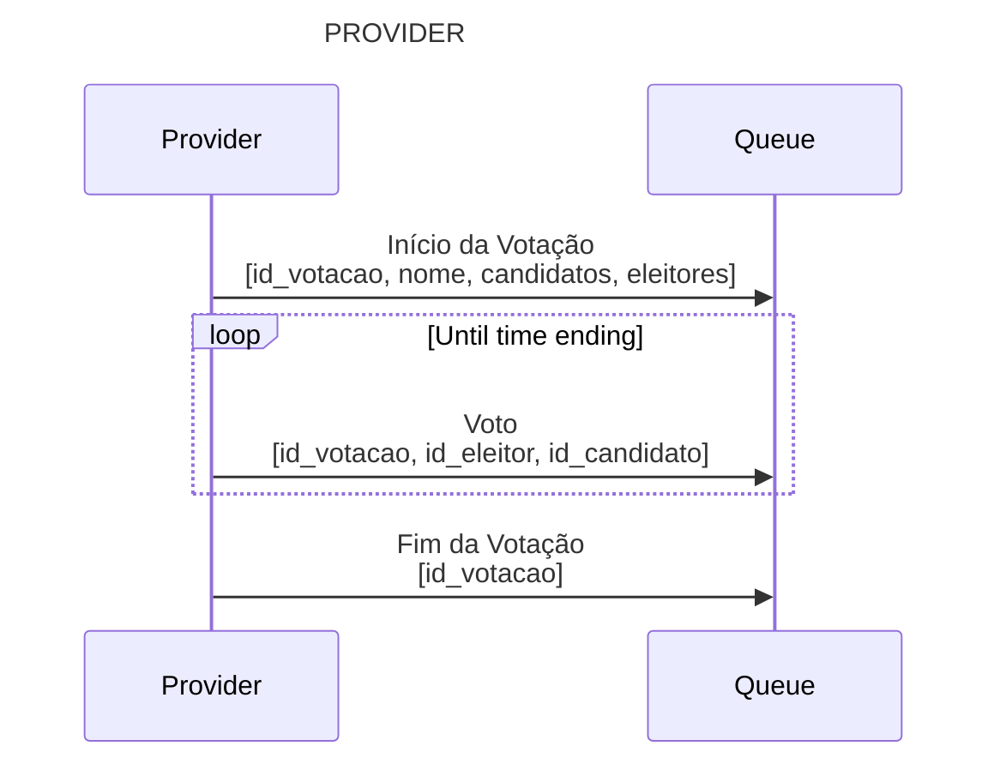
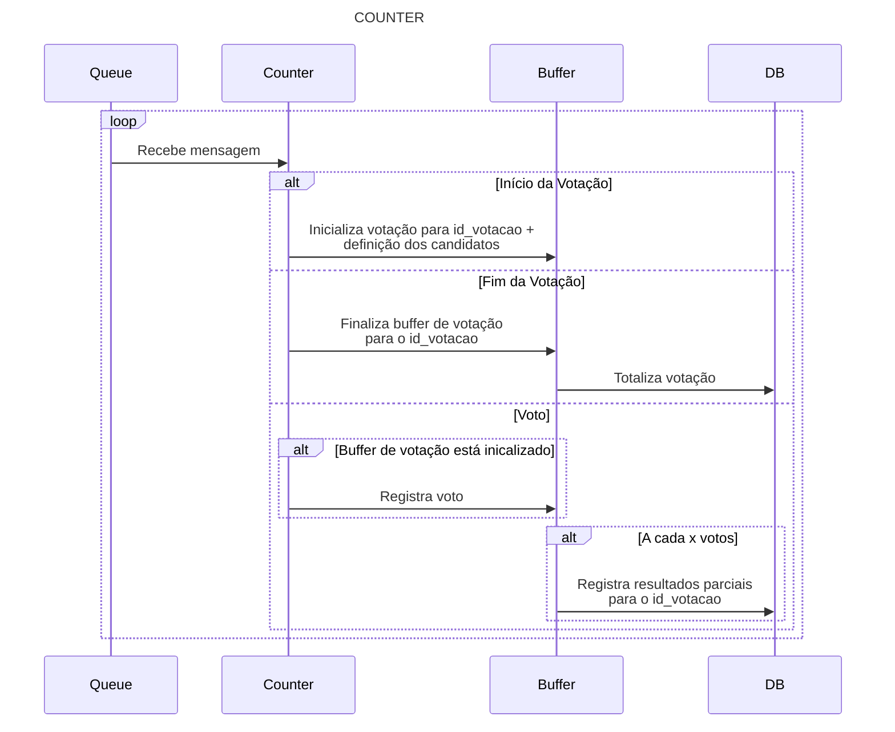

# Projeto: Aplicação de Apuração de Votos

Para controlar os dados de uma eleição vamos desenvolver um projeto de microsserviços para a coleta, processamento e apresentação de resultados.

## Domínio

* Eleição = Processo de Votação + Apuração de votos
* Candidato = Pessoa candidata a um cargo
* Eleitor = Pessoa que vota em um candidato
* Votação = coleta de votos em uma seção
* Voto = Registro da intenção de um eleitor. Único por Eleitor/Votação
  
## Contexto Inicial

A coleta dos votos será feita por um microsserviço (**PROVIDER**) que terá um fluxo da seguinte forma:



A contagem será feita por um  microsserviço (**COUNTER**) que terá um fluxo da seguinte forma:



A apresentação dos dados da eleição serão feitas por uma API com os seguintes endpoints:

* GET /eleicao/{id_votacao}
  
  * status = {inexistente, iniciado, ocorrendo, finalizado}
  * resultados = [candidatos+contagem de votos], classificacao:{primeiro_lugar, segundo_lugar}, brancos_nulos

```json
{
    "status":"...",
    "resultados":[
        {"id_candidato":0,"nome":"","votos":0}
    ],
    "classificacao":{
        "primeiro":{"id_candidato":0,"nome"."votos":0},
        "segundo":{"id_candidato":0,"nome"."votos":0}
    },
    "brancos_nulos": 0,
    "eleitores": {
        "comparecendo": 0,
        "ausentes": 0
    }
}
```

Retornando uma lista de objetos com os candidatos e seus votos recebidos, o(s) candidato(s) mais candidatos (1 ou 2).

## Modelos de Dados

### Votação

* id
* nome
* candidatos
* eleitors

```json
{
    "id":0,
    "nome":"",
    "candidatos":[
        {
            "id":0,
            "nome":""
        }],
    "eleitors":[
        {
            "id":0,
            "nome":""
        }]
}
```

### Candidato

* id
* nome

```json
{
    "id":0,
    "nome":""
}
```

### Eleitor

* id
* nome

```json
{
    "id":0,
    "nome":""
}
```

### Voto

* id_votacao
* id_eleitor
* id_candidato

```json
{
    "id_votacao":0,
    "id_eleitor":0,
    "id_candidato":0
}
```

## Mensagens

### Início da votação

* header -> tipo=inicio
* conteúdo -> Votação (json)

### Fim da votação

* header -> tipo=fim
* conteúdo -> { id_votacao: 0 }

### Voto

* header -> tipo=voto
* conteúdo -> Voto (json)
